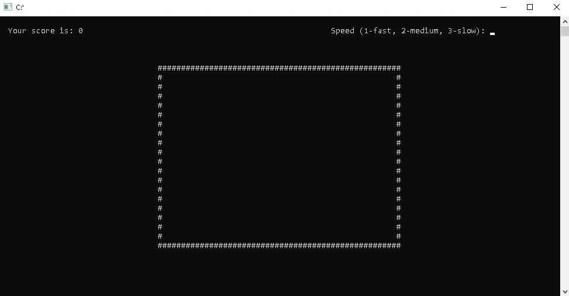
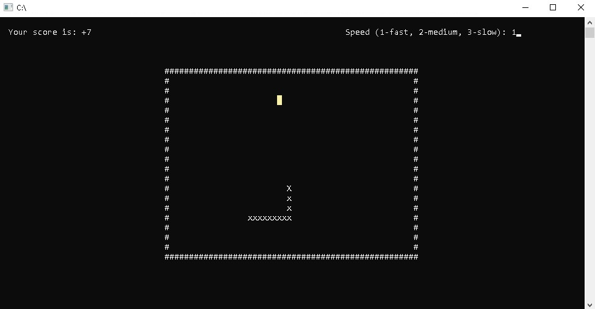
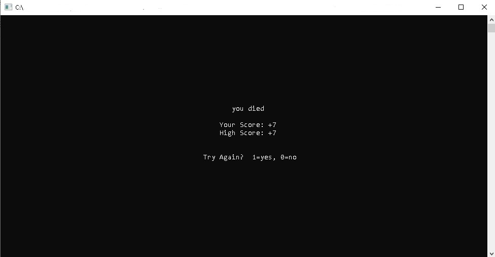

# Assembly Language Snake Game
## About the project
This program is a personal project made entirely by me when learning computer organization and architecture during the second year of my degree in Management Mathematics and Computing. The idea behind of this program was the classic "Snake" game. This program was made using Microsoft Visual Studio 2017's 32bit MASM architecture in protected mode (no interrupts) and the Irvine32 library.

## Features and Functions
#### Game Speed Selection
  * User may choose from three speed levels, level 1 to level 3, level 3 being the slowest.
  * Each of the speed levels have a 40ms difference.
#### Random Generation of coin
  * A coin is generated randomly at the start of every game or when the snake eats the previous coin.
  * A checking function is also created to make sure that the random coin doesnt generate on the coordinates of the snake. 
  * A new coin is regenerated if the current one is generated at an invalid coordinate.
#### Game Controls
  * After the coin is generated, a loop will be initiated to detect for input and jump to specific functions according to the input.
  * If no key is entered, the program will keep looping and waiting for an input. 
  * If the snake is moving and a valid input is not entered, the function will continuously loop and snake will continuous to move at the current direction.
  * If the user enters a new input that moves the snake in a different direction, the program will jump to a function that changes the function of the snake.
#### Move Snake
  * The head of the snake will be moved according to the user's last known input. 
  * The body of the snake will be moved to the coordinate of the unit before it (eg: the 3rd unit of the body will move to the coordinates of the 2nd unit of the body)
#### Coin Detection
  * When the Snake moves, the coordinate of the head is compared with the coordinate of the coin to check whether the snake eats a coin
#### Eat Coin
  * When a coin is eaten, a new unit is added to the snake to lengthen the snake.
  * The new tail is at the position of the old tail, a new tail is added according to the direction of the old tail
#### Self Collision Detection 
  * When the Snake moves, the coordinate of the head is compared with the coordinate of the coin to check whether the snake collides with itself
  * Snake dies when it collides with itself
  * A function loops through the coordinates of the body of the snake and compares with the head position to check if they collide.
#### Wall Collision Detection
  * When the Snake moves, the coordinate of the head is compared with the coordinate of the coin to check whether the snake collides with the wall
  * Snake dies when it collides with the wall
  * A function compares the coordinates of the wall and the head to check if they collide
#### Scoreboard
  * When the game is over, a scoreboard is displayed to show the current score and high score of the user.
  * The user can also choose to exit the game or restart the game.
#### Input Validation
  * Input Validation is set to detect any invalid input and prompts the user to reenter the input if so.

## Flowchart
Flowchart of this program can be downloaded here: [snake game flowchart.pdf](https://github.com/meixinchoy/SnakeGame-asm8086/files/6953798/snake.game.flowchart.pdf)

## Controls
| Keys              | Actions                     |
| ----------------- | --------------------------- |
| w                 | Move up                     |
| a                 | Move left                   |
| s                 | Move down                   |
| d                 | Move right                  |
| x                 | Quits the game at any time  |
| enter             | Pause, (w,a,s,d to unpause) |

(make sure that your capslock is disabled)

## Screenshots

## Installation
To start the game you will need to install the following items:
1. visual studios   (can be installed [here](https://visualstudio.microsoft.com/downloads/)) 
2. Irvine32 library (can be downloaded [here](https://github.com/meixinchoy/Irvine-library))
3. create ASM file, paste code in and run program

## Additional Notes
Although the program code for the master branch and the adv branch slightly differs from each other, both codes are completed and able to output and run the full program. The master branch is more basic and easier to understand whereas the code in the develop branch more compact and the end screen displays the high score as well. Feel free to check out both versions of my program.

