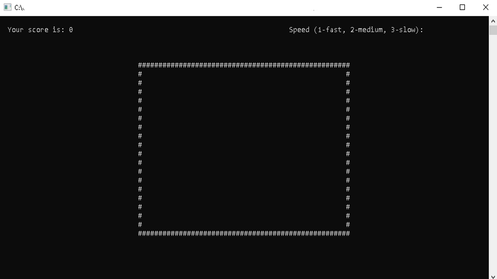
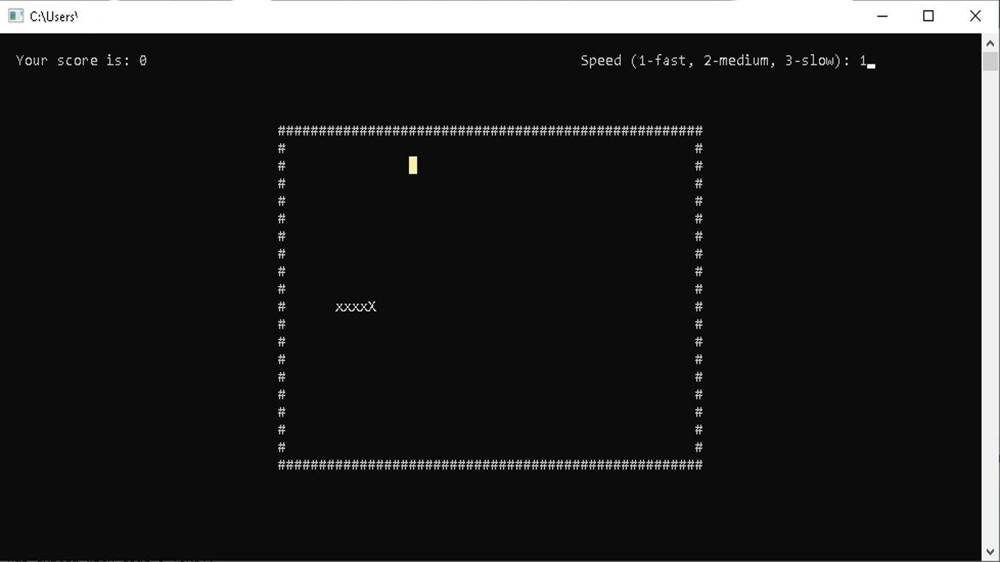
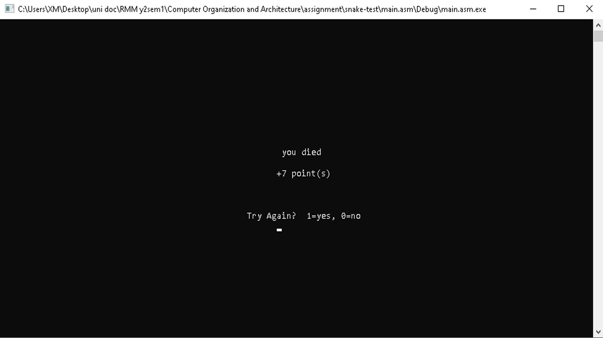

# About the project
This program is a personal project made by me when learning computer organization and architecture during the second year of my degree in Management Mathematics and Computing. The idea behind of this program was the classic "Snake" game. This program was made using Microsoft Visual Studio 2017's 32bit MASM architecture in protected mode and employs the Irvine32 library.

# Installation
To start the game you will need to install the following items:
1. visual studios   (can be downloaded [here](https://visualstudio.microsoft.com/downloads/)) 

2. Irvine32 library     (can be downloaded [here](https://github.com/Eazybright/Irvine32))

# Controls
w: move up\
a: move left\
s: move down\
d: move right\
x: exit game\
enter: pause game\
(make sure that your capslock is disabled)

# Screenshots

# Additional Notes
Although the program code for the master branch and the develop branch slightly differs from each other, both codes are completed and able to output and run the full program. The master branch is slightly longer than the develop branch but it is easier to understand whereas the develop branch is shorter as I have combined move up, down, left and right into one section. Feel free to check out both versions of my program.

